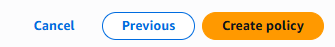
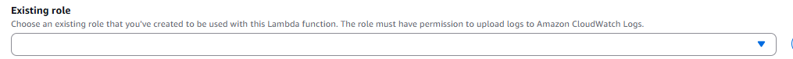

# Set up AWS EC2 Instance to automatically start and stop at a specific point in time.

## Full Step-by-Step guide with snapshots to describe and illustrate how an AWS EC2 Instance can start and stop at custom times

### This project demonstrates how one can both test the stopping and starting of an EC2 Instance as well as scheduling both a customized stop and start time for an EC2 Instance. In this project, we will be covering how to:
*Create an EC2 Instance 
* Create a Lambda Function for both stopping and starting the created EC2 Instance
*  Set up the appropriate policies to test both the stopping and starting of an EC2 Instance.
*  Create a CloudWatch schedule to both stop and start the EC2 Instance automatically at Custom Times.

#### Step-by-Step Instructions on how to set up customizable times to both Start and Stop an EC2 Instance:

---

# **EC2 Instance Setup**

**Select EC2 from AWS Searchbox and Select EC2 Pop up option**

  
    

  

**Select the Launch Instance tab**

  
    

  

**Give your instance a name & select an AMI for the instance** 

  
    

  

**Select the instance type & Select the key pair**

  
    

  

**Click Launch Instance at the bottom**

  
    

  

---

# **Policies**

**Search IAM and open Policies**

  
    

  

**Click Create Policy**

  
    

  

**Select the JSON tab**

  
    

  

**Insert custom policy code**

  
    

  

**Click Next**

  
    

  

**Create a name for your policy**

  
    

  

**Click Create Policy**

  
    

  

**Open Roles from the sidebar**

  
    

  

**Click Create Role**

  
    

  

**Select Lambda as the service or use case**

  
    

  

**Attach the previously created policy**

  
    

  

**Click Next**

  
    

  

**Give your role a name**

  
    

  

**Click Create Role**

  
    

  

---

# **Lambda — Test Instance Start/Stop**

**Open Lambda from the AWS search bar**

  
    

  

**Click Create Function**

  
    

  

**Enter function name**

  
    

  

**Select Python 3.9 as runtime**

  
    

  

**Use an existing role**

  
    

  

**Select the role created earlier**

  
    

  

**Click Create Function at the bottom**

  
    

  

**Copy EC2 Instance ID from the instance details**

  
    

  

**Add Lambda function code for stop instance and insert instance ID**

  
    

  

**Create and run a new test**

  
    

  

**Deploy the function code**

  
    

  

**Open Functions**

  
    

  

 **Select the created function**

  
    

  

**Test the function from the Actions dropdown**

  
    

  

**Click Test**

  
    

  

**Check EC2 instance shows 'Stopping'**

  
    

  

**Repeat steps with modified code to start instance**

  
    

  

---

# **Create CloudWatch Schedule (Stop Instance Automatically)**

**Search CloudWatch and open it**

  
    

  

**Select View Events**

  
    

  

**Click Create Rule**

  
    

  

**Name the rule and select Schedule type**

  
    

  

  
    

 

**Click Continue to Create Rule**  

  
    

  

**Set custom schedule time**

  
    

  

**Choose Lambda function as target**

  
    

  

**Select stop function and create rule**

  
    

  

**Verify EC2 instance stops at scheduled time**

  
    

  

---

# **Create CloudWatch Schedule (Start Instance Automatically)**

**Repeat steps from stop schedule setup, except for using a different rule name and selecting the start function**

  
    

  

  
    

  

  
  

  

 

##### Contribution Policy

This project is not accepting external contributions, including pull requests or feature requests.

It serves as a personal archive of my learning journey in applying foundational concepts in software development and version control. Active development is not ongoing, and external changes will not be integrated.

Thank you for your understanding.
